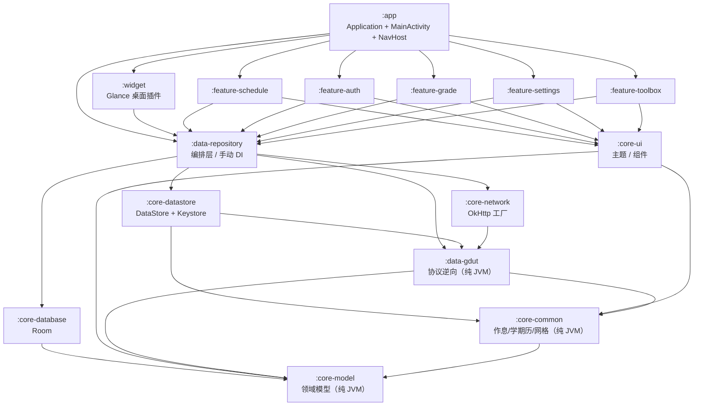

# 00 · 架构

本文回答"项目为什么长成这样"。每条设计决策都写明**理由**与**被否决的替代方案**，
因为替代方案往往才是后来者最想改回去的地方。

相关文档：[协议逆向](./01-gdut-protocol.md) · [数据模型](./02-data-model.md) ·
[UI 规格](./03-ui-spec.md) · [插件规格](./04-widget-spec.md) ·
[任务清单](./05-agent-task-list.md) · [测试策略](./06-testing-strategy.md) ·
[登录验证](./07-verify-login.md)

---

## 1. 模块依赖图



```text
                 ┌──────────────────────────────────────────────┐
                 │                    app                        │
                 └───────┬───────────────────────────┬───────────┘
                         │                           │
              ┌──────────▼───────────┐      ┌────────▼─────────┐
               │  feature-*（5 个）   │      │      widget      │
              └──────────┬───────────┘      └────────┬─────────┘
                         │                           │
                         └─────────────┬─────────────┘
                                       ▼
                          ┌─────────────────────────┐
                          │     data-repository      │  ← 唯一知道"同步流程"的模块
                          └──┬────────┬────────┬─────┘
                             │        │        │
             ┌───────────────┘        │        └────────────────┐
             ▼                        ▼                         ▼
   ┌──────────────────┐    ┌──────────────────┐    ┌──────────────────┐
   │  core-database   │    │  core-datastore  │    │   core-network   │
   │      (Room)      │    │ (DataStore+Key)  │    │     (OkHttp)     │
   └──────────────────┘    └────────┬─────────┘    └────────┬─────────┘
                                    │                       │
                                    └───────────┬───────────┘
                                                ▼
                                    ┌───────────────────────┐
                                    │      data-gdut        │  ← 纯 JVM，协议逆向
                                    └───────────┬───────────┘
                                                ▼
                              ┌─────────────────────────────────────┐
                              │   core-common  →  core-model        │  ← 纯 JVM
                              └─────────────────────────────────────┘
```

**依赖方向的两条硬规则**（违反即编译失败，不是靠自觉）：

1. 依赖只从上往下。`core-model` / `core-common` / `data-gdut` 在最底层，
   谁都能依赖它们，它们不依赖任何模块。
2. **`widget` 不得依赖 `app`**。`app` 依赖 `widget`，反向依赖会形成 Gradle 项目环。
   这条约束直接导致了插件 module 通过 `data-repository` 的静态 holder 取容器（见 [任务清单](./05-agent-task-list.md)）。

---

## 2. 每个模块的职责，以及"为什么单独成模块"

| 模块 | 职责 | 为什么单独成模块 |
|---|---|---|
| `core-model` | 纯领域模型：`Term` `Course` `Grade` `Exam` `Campus` `GdutException`。零第三方依赖。 | 所有模块共享的最小词汇表。把它做成零依赖，才能保证"业务概念"不会被任何框架污染。 |
| `core-common` | 与 Android 无关的纯逻辑：作息表、学期历、节次切分、课表网格构建、配色。 | 与协议无关，但被 UI、Widget、Repository 三方共用。做成纯 JVM 才能穷举单测（见 [测试策略](./06-testing-strategy.md)）。 |
| `data-gdut` | **协议逆向层**：登录加密、表单构造、重定向跟随、HTML/JSON 解析、图书馆二维码。风险最高。 | 全部与 Android 无关；做成纯 JVM 后整个登录流程可以在 JVM 上用 MockWebServer 离线回归，不需要模拟器。学校改接口时只改这一个模块 + 补 fixture。 |
| `core-network` | `OkHttpClient` 工厂 + 网络状态监听。极薄。 | 全 App 只能有一个根 `OkHttpClient`（连接池/线程池）。集中一处创建，供 Repository 与插件共享。 |
| `core-database` | Room 数据库、实体、DAO、映射。 | 课表/成绩是关系型查询；Widget 需要只读快速取当天课程。 |
| `core-datastore` | `UserSettings`（DataStore Preferences）+ 加密的会话/凭据（AndroidKeyStore）。 | 会话 cookie 等同账号，必须与普通偏好分开、单独加密存储。 |
| `core-ui` | 主题、通用组件、可复现的纯函数（WCAG 对比度、颜色转换）。 | 叶子模块：谁都能依赖它，它不依赖任何数据模块。纯函数部分可离线单测。 |
| `data-repository` | 编排层：读路径（Room Flow → UI State）+ 写路径（多接口同步）+ 手写 DI 容器。 | 唯一同时依赖三种数据源的模块，也是唯一知道"同步流程长什么样"的模块。UI 完全不知道 authserver / jxfw 的存在。 |
| `feature-*`（5 个） | 五个页面：课表、登录、成绩、设置、工具箱。只依赖 `data-repository` 与 `core-ui`。 | 按页面切分，避免"一个巨大的 UI 模块"。每个功能模块可以独立编译与测试。 |
| `widget` | 两个 Glance 桌面插件。 | Glance 有独立的入口（Receiver）、独立的生命周期，与 Activity 无关。 |
| `app` | Application、MainActivity、NavHost。**代码量刻意控制在几百行内**。 | 应用壳。一旦它开始膨胀，说明有东西放错地方了。 |

`app/build.gradle.kts` 的注释把这条原则写死了：
> app 模块的代码量应该始终保持在几百行以内 —— 一旦它开始膨胀，说明有东西放错地方了。

---

## 3. 核心决策一：为什么不用 WebView

这是项目立项时最关键的一条。旧版是 uni-app 小程序，本质就是 WebView。
原生重写最重要的收益恰恰来自"摆脱 WebView"，具体四条：

| # | 理由 | 说明 |
|---|---|---|
| 1 | **冷启动** | WebView 首次初始化要加载内核、建渲染进程、跑 JS 引擎，冷启动通常 300ms～1s 起。本项目冷启动只构造一个 `by lazy` 的容器对象，首屏直接读 SQLite。两者不在一个量级。 |
| 2 | **内存** | 一个 WebView 实例常驻 50～150MB（厂商内核差异大）。课表 App 的用户画像里有大量中低端机，"占内存"是会被卸载的。 |
| 3 | **桌面插件根本用不了 WebView** | App Widget 运行在 launcher 进程的 RemoteViews 沙箱里，**不可能**塞 WebView。如果主体是 WebView，桌面插件就只能重写一套原生实现，反而变成两份 UI。 |
| 4 | **离线** | 小程序依赖网络加载页面壳；原生 App 首屏直接读 Room，教务系统维护、图书馆地下没信号时依然可用。 |

被否决的替代方案：
- **WebView + H5 复用旧代码**：能最快上线，但上述四条全部命中，等于没重写。
- **Flutter / React Native**：仍要打包一个运行时，冷启动与内存介于原生与 WebView 之间；
  且桌面插件同样要写原生侧。

---

## 4. 核心决策二：为什么不用 Hilt / Dagger

`data-repository/AppContainer.kt` 把理由写成了三条，全部对应"启动速度、资源占用"两个目标：

1. **启动速度**：Hilt 在 `Application.onCreate` 里实例化依赖图，冷启动多花 30～100ms；
   Dagger 的 `Lazy` / `Provider` 还多一层间接。手写容器就是一个 `by lazy` 对象图，
   第一个字段被访问时才构造，**零启动开销**。
2. **包体积**：Hilt + Dagger runtime + 生成代码约 1.5～2MB。本项目总共十几个可注入类型。
3. **构建稳定性**：Hilt 的版本必须与 Kotlin / KSP / AGP 三方对齐。本项目用的是 AGP 9 的
   built-in Kotlin（见 [`gradle.properties`](../gradle.properties) 注释），再叠一个 KSP 处理器
   等于把最难调的那类构建问题引进来。

代价：没有编译期校验"某个依赖忘了提供"。项目规模（<20 个可注入类型）完全可控，
而且容器是**一个文件**，漏了什么一眼能看到。

配套约定：
- 所有字段 `by lazy`，构造顺序即依赖顺序；
- **不在字段初始化里做 I/O**。`database` 的 lazy 只拿到 `RoomDatabase` 实例，
  真正的 SQLite 打开发生在第一次查询；`sessionStore` / `credentialStore` 的 lazy 只在
  对象里记下路径，文件读推迟到第一次 `current()`。这是整套启动优化成立的前提。
- ViewModel 的工厂用 `viewModelFactory { initializer { ... } }` 手写，
  缺依赖在编译期暴露（见 `ScheduleViewModel.factory`）。

---

## 5. 核心决策三：为什么直连学校，不做自己的后端

旧项目是 `uni-app 前端 → 自建 Java 后端 → 学校接口`。本项目**刻意不复用那个后端**：

| 理由 | 说明 |
|---|---|
| **不需要 `GDUTDAYS_SECRET`** | 旧后端要求客户端带一个共享密钥，本质是"防止接口被白嫖"，而这个 App 只有用户自己用，没有这个需求。 |
| **不依赖第三方服务器** | 旧后端的 `api.cerbur.top` 是个人服务器，随时可能挂；一旦挂了，全部用户不可用。本项目没有这个单点。 |
| **少一跳** | 每个请求少一次网络往返，登录链路上的收益尤其明显。 |
| **cookie 不出本机** | 旧方案要把用户的会话 cookie 上传到第三方后端才能代抓。本项目 cookie 只存在于 `AndroidKeyStore` 加密的本地文件里，**从不上传**。 |

代价与对策：
- 协议解析、加密、HTML 解析全部搬到端上 → 集中在 `data-gdut`，做成纯 JVM 可测（见下节）。
- 没有服务端兜底 → 用 Room 做离线缓存，同步失败**不清空已有数据**（见 [数据模型](./02-data-model.md)）。

---

## 6. 冷启动路径分解

目标：**首屏（课表页）尽可能早出现，网络永远不在关键路径上。**

### `Application.onCreate` 做了什么

```kotlin
// app/.../GdutDayApplication.kt
override fun onCreate() {
    super.onCreate()
    val built = DefaultAppContainer(
        context = this,
        destructiveMigrationFallback = BuildConfig.DEBUG,
        logHttp = BuildConfig.DEBUG,
    )
    container = built
    AppContainerHolder.install(built)
    SyncListeners.register { /* 同步完成 → 刷新桌面插件 */ }
    CoroutineScope(SupervisorJob() + Dispatchers.IO).launch {
        built.authRepository.reloginSilently()
    }
}
```

实际是**四步**，每步都是 O(1) 或已移出关键路径：

1. **构造容器对象**：`DefaultAppContainer` 的构造函数体里只有一次
   `context.applicationContext` 读取，不碰磁盘、不开数据库、不建网络连接。
   所有字段都是 `by lazy`，第一个字段被访问时才构造，零启动开销。

2. **注册到 `AppContainerHolder`**：widget 模块拿不到 `GdutDayApplication` 这个类型
   （app 依赖 widget，反向依赖会成环），所以容器还要注册到 data-repository 的
   进程级 holder。只是一次静态字段赋值，O(1)。

3. **注册同步完成监听（`SyncListeners.register`）**：同步完成后刷新桌面插件。
   这个接线必须放在 app 模块：data-repository 不能引用 widget（会成环），widget
   也不知道"同步"何时发生。注册只是往 `CopyOnWriteArrayList` 加一个 lambda，O(1)。

4. **后台静默重登（`reloginSilently`）**：在 `Dispatchers.IO` 协程里执行，
   **不阻塞** `onCreate`。内部只对 UNIFIED_AUTH 生效且有 `runCatching` 兜底；
   Session 恢复后 `isLoggedIn → true`，NavHost 自动跳回课表页。

明确**不做**的事（每一项都会拖慢冷启动，且都可推迟）：

- 不预热网络（提前建 TLS 连接）：首屏读 Room 就够了，预热反而占 CPU。
- 不初始化 WorkManager 之外的任何 SDK：本项目没有第三方 SDK。
- 不读 DataStore：设置项在课表页真正需要时才读。
- 不打开数据库：Room 的 `databaseBuilder.build()` 不打开 SQLite，第一次查询才打开。
- 不做检查更新 / 统计上报：本项目没有这类功能。

### 首屏读什么

- `MainActivity.onCreate` 只调用 `setContent`，不读任何数据。
- `GdutDayNavHost` 的 `startDestination = Routes.SCHEDULE`（**不是登录页**）。
- `ScheduleScreen` 收集 `ScheduleRepository.observeScheduleUiState()`，该 Flow 的输入是
  五个 Room Flow + 两个内存 `StateFlow`，**首帧就能从 SQLite 出内容**。
- `AuthRepository.session` 用 `stateIn(scope, SharingStarted.Lazily, null)`：
  构造函数里不读盘，第一个订阅者出现时才解密会话文件。未登录用户与只用本地缓存的用户
  完全不会为一次文件解密付费。

### 起始路由为什么不是登录页

如果起始路由是登录页，每次冷启动都要先解密会话、判断登录态才能决定显示什么，
那段等待是纯粹的白屏。改为课表页后：

- 未登录：课表页显示空状态 + 登录入口，用户看到"App 已经打开了"；
- 已登录：课表页立刻显示上次缓存的数据，同步在后台进行。

会话失效时由 `GdutDayNavHost` 的 `LaunchedEffect` 主动导航到登录页。
`isLoggedIn` 的初值刻意给 `true`，否则第一帧就会满足"未登录"条件，
在会话解密完成前闪一下登录页。

### 什么时候才碰网络

只有这三处：

1. 用户在课表页下拉刷新 / 点同步菜单 → `SyncScheduler.requestImmediateSync(expedited = true)`；
2. WorkManager 的周期同步 `ScheduleSyncWorker`；
3. 登录页提交。

网络同步全部在后台线程，UI 只显示顶部细进度条（`LinearProgressIndicator`），
**不是**全屏 loading。

---

## 7. 线程模型

`data-gdut` 里所有 Client 方法都是**阻塞**的（OkHttp 同步调用），刻意不引入 `suspend`，
这样单元测试可以直接跑，不需要 `runBlocking`。切线程的责任在调用方：

| 位置 | 线程处理 | 说明 |
|---|---|---|
| `AuthRepositoryImpl.login` / `loginViaJxfw` / `fetchJxfwCaptcha` / `isSessionValid` / `reloginSilently` | `withContext(Dispatchers.IO)` | 每个方法显式包一层。 |
| `GradeRepositoryImpl.sync` | `withContext(Dispatchers.IO)` | 同上。 |
| `ScheduleRepositoryImpl.sync` | 无显式 `withContext` | 它只由 `ScheduleSyncWorker`（WorkManager 后台线程）驱动，天然不在主线程。 |
| `LibraryRepositoryImpl.renderEntryQr` | `withContext(Dispatchers.Default)` | 纯 CPU 的 zxing 编码。 |
| `DefaultAppContainer.appScope` | `SupervisorJob() + Dispatchers.Default` | Application 级作用域，承载会话共享与后台排程。 |
| `LoginViewModel` | 只 `viewModelScope.launch`，**不再切 IO** | Repository 内部已切，多切一层只是多一次调度。 |

`core-network` 的 `HttpClientFactory` 只创建**一个**根 `OkHttpClient`；
`data-gdut` 里各 Client 用 `newBuilder()` 派生（绑定临时 CookieJar、关掉自动重定向），
派生实例共享连接池与线程池，因此廉价，**不需要也不应该手动关闭**。

`ScheduleUiState` 的所有派生字段（`grid` / `todayBlocks` / `colorAssignment` / `calendar`）
在 Repository 里算好，ViewModel 一行计算都不做。理由见 [UI 规格](./03-ui-spec.md)：
放进 ViewModel 会让 Widget 需要复制逻辑，还会拖慢旋转屏幕后的重建。

---

## 8. WorkManager 的初始化链路

`app` 的 manifest 用 `tools:node="remove"` 删掉了 `androidx.startup` 的
`WorkManagerInitializer`，目的是不让默认实现新建一套线程池。删除之后，
**必须有人在任何 `WorkManager.getInstance()` 之前显式初始化**。

`DefaultAppContainer` 承担这个职责：`workManager` 的 lazy 块先
`WorkManager.initialize(...)` 再 `getInstance`。由于全 App 只有 `syncScheduler` 会碰
WorkManager，而 `syncScheduler` 只在真正要排程时才被访问，所以初始化一定发生在第一次使用之前。
`workManagerConfiguration` 里装上 `GdutWorkerFactory`，把 Repository 注入 Worker。

`catch (IllegalStateException)` 是为了兼容"默认初始化没被删掉"的构建变体
（例如单元测试或将来某次 manifest 改动）。

---

## 9. 发布流程

### 签名配置放在哪

`app/build.gradle.kts` 的 `signingConfigs {}` 是**空的**，且 `release` 不绑定
`signingConfig`。这是有意的：

- 未配置 `signingConfig` 时 `assembleRelease` 产出的是 **unsigned apk**，
  强制发布走显式配置，避免误用 debug 签名发布。
- 正确做法：在 `~/.gradle/gradle.properties`（**不是**项目里的 `gradle.properties`）
  或 CI secret 里配置 `GDUTDAY_STORE_FILE` / `GDUTDAY_STORE_PASSWORD` /
  `GDUTDAY_KEY_ALIAS` / `GDUTDAY_KEY_PASSWORD`，再在 `app/build.gradle.kts` 里读取。
- `*.keystore` 已被 `.gitignore` 忽略；`!debug.keystore` 是唯一例外。

⚠ **当前 release 签名尚未配置**，是待办项（见 [任务清单](./05-agent-task-list.md)）。

### R8 / 包体积

```kotlin
release {
    isMinifyEnabled = true          // R8 全量模式
    isShrinkResources = true
    proguardFiles(
        getDefaultProguardFile("proguard-android-optimize.txt"),
        "proguard-rules.pro",
    )
}
```

`proguard-rules.pro` 的原则是"能不加规则就不加"。本项目没有反射式框架
（没有 Hilt/Dagger/Gson/Moshi 的运行时反射），所以 keep 规则很少：

- kotlinx.serialization 的 `serializer()` 通过反射查找，必须保留；
- OkHttp 5 用 `ServiceLoader` 加载 TLS 扩展，加 `-dontwarn`；
- zxing 的多平台分支 `-dontwarn`；
- Room 的 `@Dao` 接口保守保留；
- 保留 `SourceFile,LineNumberTable` 并 `-renamesourcefileattribute SourceFile`。

⚠ `widget` 模块通过 `data-repository` 里的 `AppContainerHolder` 静态 holder 取 `AppContainer`，
`GdutDayApplication.onCreate` 调用 `install()`，widget 直接读 `get()`。零反射，R8 安全。
（之前曾用反射按返回类型匹配，已替换；详见 [任务清单 T1.3](./05-agent-task-list.md)。）
因此即使类名和方法名被重命名，类型身份依然一致，理论上不需要 keep 规则 ——
但这一条**从未在 release 包上验证过**，见 [任务清单](./05-agent-task-list.md)。

### versionCode / versionName

在 `app/build.gradle.kts`：

```kotlin
defaultConfig {
    versionCode = 1
    versionName = "1.0.0-alpha01"
    resourceConfigurations += listOf("zh-rCN")   // 只保留中文资源
}
```

`resourceConfigurations` 只留中文，因为目标用户 100% 是中文使用者，
能减小 `resources.arsc`。debug 变体额外加 `applicationIdSuffix = ".debug"` 与
`versionNameSuffix = "-debug"`。

### 每次改 schema 必做

`core-database` 用 `room.schemaLocation = $projectDir/schemas` 导出 schema JSON。
**schema JSON 必须提交进仓库**，它是写 `MigrationTest` 的唯一依据。
发布前必须把 `fallbackToDestructiveMigration` 从 release 移除，详见
[数据模型 · 迁移策略](./02-data-model.md)。

### 其他发布前检查

- `HttpConfig.logHttp` 必须为 `false`（release 构建由 `BuildConfig.DEBUG` 决定，天然为 false）。
- `android:allowBackup="false"`：备份里含 Keystore 加密的会话文件，而密钥不随备份迁移，
  恢复后必然解密失败。与其让用户遇到"恢复备份后一直闪退"，不如直接关掉。
- 权限只声明 `INTERNET` 与 `ACCESS_NETWORK_STATE`。manifest 里逐条列出了
  "刻意不声明的权限及原因"（相机、存储、日历、通知、精确闹钟、开机广播）。
